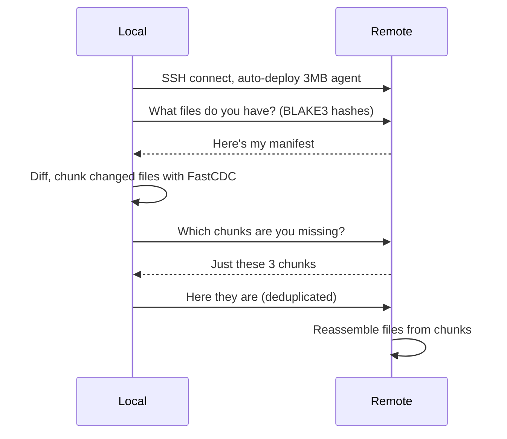

<p align="center">
  
</p>

<p align="center">
  <strong>Bidirectional file sync over SSH.</strong><br>
  Zero remote dependencies. Native .gitignore. Content-addressed.
</p>

<p align="center">
  <code>nix run github:andrewgazelka/zsync -- user@server</code>
</p>

---

Tired of:

- **rsync** re-uploading entire files for tiny changes
- **mutagen** requiring a 50MB daemon and complex setup
- **scp** having no idea what `.gitignore` is

zsync fixes this. Your remote server needs nothing installed — a 3MB agent auto-deploys via SSH.

## Install

```bash
# Nix (recommended)
nix run github:andrewgazelka/zsync

# Cargo
cargo install --git https://github.com/andrewgazelka/zsync
```

## Usage

```bash
# Sync current directory to remote (auto-creates ~/zsync/<dir_name>)
zsync root@server

# Custom SSH port
zsync root@server -p 22222
zsync root@server:22222           # same thing

# Explicit remote path
zsync root@server:/workspace/project

# Watch mode — bidirectional sync as you edit locally or remotely
zsync root@server --watch

# Delete remote files not present locally
zsync root@server --delete
```

## Why zsync?

| | rsync | mutagen | zsync |
|---|:---:|:---:|:---:|
| **Only sends changed bytes** | ❌ Often whole file | ❌ Often whole file | ✅ FastCDC chunks |
| **Cross-file dedup** | ❌ | ❌ | ✅ Content-addressed |
| **Zero remote setup** | ❌ Must install | ✅ Auto-deploy | ✅ Auto-deploy |
| **Agent size** | N/A | ~50MB | **~3MB** |
| **Native .gitignore** | ❌ Manual flags | ❌ Partial | ✅ Full support |
| **Bidirectional sync** | ❌ | ✅ | ✅ Built-in |
| **Watch mode** | ❌ External tools | ✅ Built-in | ✅ Built-in |
| **Port forwarding** | ❌ | ❌ | ✅ Built-in |

## How It Works

zsync uses **content-addressed storage** with **FastCDC chunking**. Files are split into variable-size chunks based on content, not position. Each chunk is identified by its BLAKE3 hash.



**Result:** If you change one line in a 10MB file, only ~4KB transfers. Sync multiple similar projects and shared code chunks are never re-sent.

## Configuration

Optional `.zsync.toml` in your project:

```toml
# Include files even if gitignored
include = [".env", "config/*.local"]

# Port forwarding (active in watch mode)
[[forward]]
local = 8080
remote = 8080

[[forward]]
local = 5432
remote = 5432
```

## Platforms

**Local:** macOS (Apple Silicon, Intel), Linux
**Remote:** Any Linux server with SSH

## Status

Production-ready with bidirectional sync in watch mode.

---

MIT OR Apache-2.0
