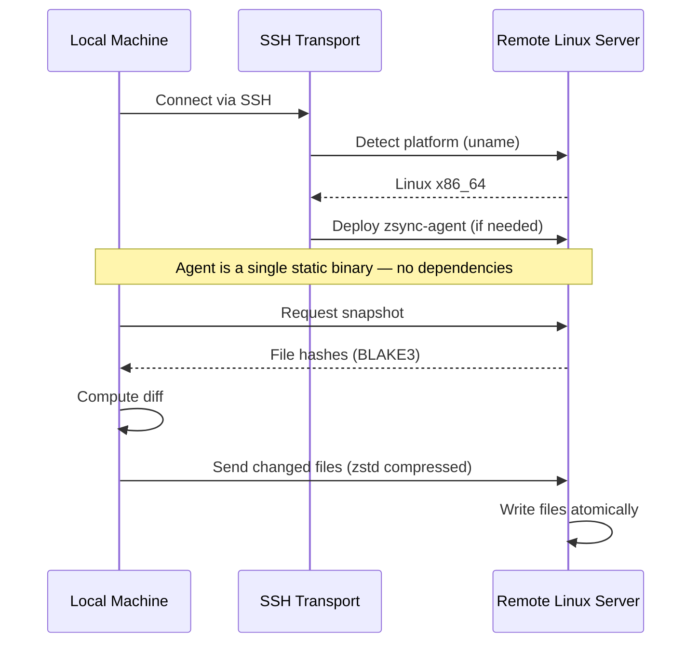

<p align="center">
  
</p>

<p align="center">
  <code>nix run github:andrewgazelka/zsync -- watch ./local user@host:/remote</code>
</p>

A modern alternative to rsync and mutagen for syncing files over SSH.

## Why zsync?

**Your remote server needs nothing installed.** zsync auto-deploys a tiny, statically-linked agent over SSH. No rsync, no dependencies, no setup — just SSH access.

| Feature | rsync | mutagen | zsync |
|---------|-------|---------|-------|
| Remote dependencies | rsync required | mutagen required | **None** |
| Respects .gitignore | ❌ Manual exclude | ⚠️ Separate config | ✅ **Automatic** |
| Watch mode | ❌ External tools | ✅ Built-in | ✅ Built-in |
| Delta sync | ✅ | ✅ | ✅ |

## Features

- **Zero remote dependencies** — Agent auto-deploys via SSH (Linux x86_64/aarch64)
- **Native .gitignore** — Respects your existing ignore files automatically
- **Delta sync** — Only transfers what changed (rsync algorithm)
- **Watch mode** — Continuous sync with debouncing
- **Static binaries** — Works on any Linux server, no glibc version issues
- **Fast** — BLAKE3 hashing, zstd compression, pipelined transfers

## Quick Start

```bash
# One-time sync
zsync sync ./project user@server:/home/user/project

# Watch mode (continuous)
zsync watch ./project user@server:/workspace
```

## Install

```bash
# Nix (recommended)
nix run github:andrewgazelka/zsync

# Cargo
cargo install --git https://github.com/andrewgazelka/zsync
```

## How It Works



**The key insight:** zsync embeds pre-compiled static agents for Linux x86_64 and aarch64. When you connect, it detects the remote platform, uploads the ~3MB agent binary, and runs it. The agent handles all file operations on the remote side.

No `apt install`. No version conflicts. No "rsync: command not found".

## Supported Platforms

**Local (where you run zsync):**
- macOS (Apple Silicon, Intel)
- Linux (x86_64, aarch64)

**Remote (where files sync to):**
- Any Linux server with SSH access (x86_64, aarch64)
- Works on minimal containers, VMs, cloud instances — anywhere with SSH

## Status

Early development. Core sync and watch mode work. Bidirectional sync coming soon.

---

MIT OR Apache-2.0
