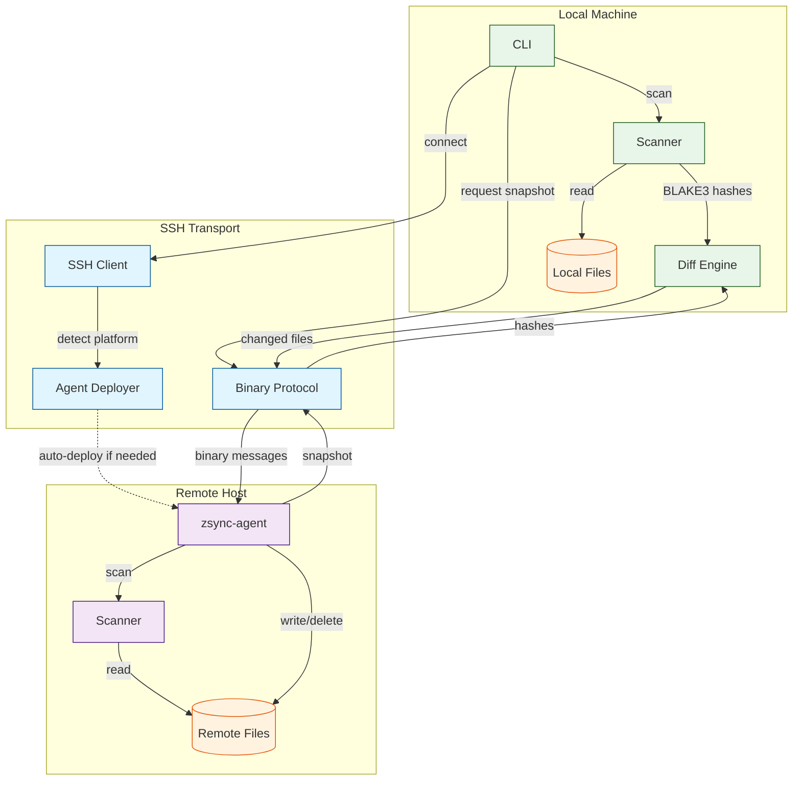

<p align="center">
  
</p>

<p align="center">
  <code>nix run github:andrewgazelka/zsync -- watch ./local user@host:/remote</code>
</p>

A modern alternative to rsync and mutagen. Syncs files over SSH with automatic `.gitignore` support.

## Features

- **Native .gitignore**: Respects your existing ignore files automatically
- **Delta sync**: Only transfers what changed (rsync algorithm)
- **File watching**: Continuous sync with debouncing
- **Zero remote deps**: Agent binary auto-deploys via SSH
- **Fast**: BLAKE3 hashing, zstd compression, pure Rust

## Usage

```bash
# One-time sync
zsync sync ./project user@server:/home/user/project

# Watch mode (continuous)
zsync watch ./project user@server:/workspace

# Scan local directory
zsync scan ./project
```

## Install

```bash
# Nix (recommended)
nix run github:andrewgazelka/zsync

# Cargo
cargo install --git https://github.com/andrewgazelka/zsync
```

## How It Works



**Sync Flow:**
1. **Scan** - CLI scans local directory respecting `.gitignore`, computes BLAKE3 hashes
2. **Connect** - SSH authenticates, detects remote platform, auto-deploys agent if needed
3. **Snapshot** - Agent scans remote directory, returns hashes over binary protocol
4. **Diff** - CLI computes added/modified/removed files
5. **Transfer** - Changed files sent to agent, removed files deleted

## Status

Early development. Core sync works, watch mode works. Bidirectional sync coming soon.

---

MIT OR Apache-2.0
