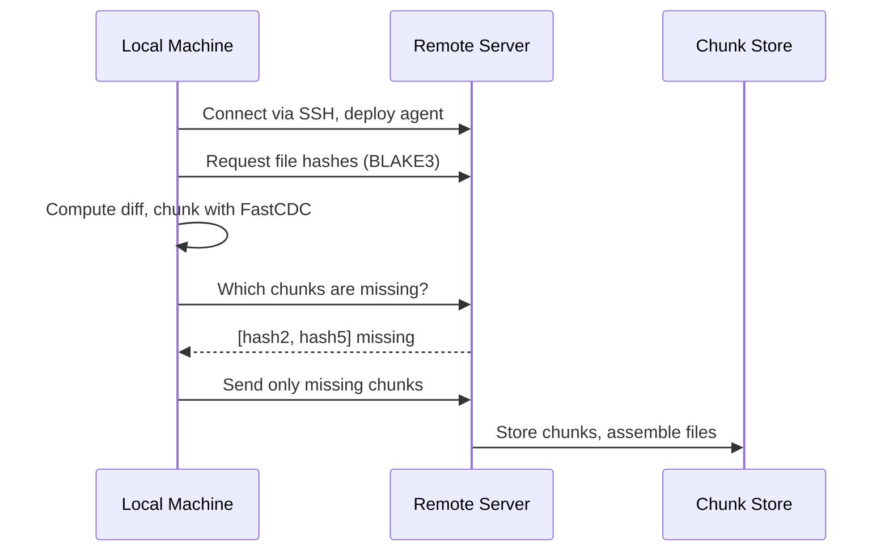

<p align="center">
  
</p>

<p align="center">
  <code>nix run github:andrewgazelka/zsync -- watch ./local user@host:/remote</code>
</p>

A modern alternative to rsync and mutagen for syncing files over SSH.
**Your remote server needs nothing installed** — zsync auto-deploys a tiny agent via SSH.

## Quick Start

```bash
# One-time sync
zsync sync ./project user@server:/home/user/project

# Watch mode (continuous sync + port forwarding)
zsync watch ./project user@server:/workspace
```

## Configuration

Drop a `.zsync.toml` in your project root:

```toml
# Include files even if they're gitignored
include = [".env", "secrets/config.yaml"]

# Port forwarding (active during watch mode)
[[forward]]
local = 8080
remote = 8080

[[forward]]
local = 3000
remote = 3000
remote_host = "api-server"  # Forward to api-server:3000 on the remote
```

**Port forwarding** happens automatically in watch mode — access remote services at `localhost:8080` without a separate SSH tunnel.

## Install

```bash
# Nix (recommended)
nix run github:andrewgazelka/zsync

# Cargo
cargo install --git https://github.com/andrewgazelka/zsync
```

## Why zsync?

| Feature | rsync | mutagen | zsync |
|---------|-------|---------|-------|
| Cross-sync dedup | None | None | **Persistent CAS** |
| Agent binary size | N/A (requires install) | ~50MB | **~3MB** |
| Remote setup | Manual install | Auto-deploy | **Auto-deploy** |
| Respects .gitignore | Manual flags | Ignores global | **Full support** |
| Watch mode | External tools | Built-in | Built-in |
| Edit → re-upload | Often whole file | Often whole file | **Only changed parts** |

**Key features:**
- **Zero remote dependencies** — Agent auto-deploys via SSH (Linux x86_64/aarch64)
- **CAS deduplication** — Content-addressable storage ensures each chunk is only sent once, ever
- **FastCDC chunking** — Content-defined chunking finds reusable blocks across all files
- **Native .gitignore** — Respects your existing ignore files automatically
- **Port forwarding** — Forward local ports to remote services through SSH
- **Static binaries** — Works on any Linux server, no glibc version issues

## How It Works



Chunks are stored by BLAKE3 hash — if two files share content, those chunks exist once. Sync similar projects and unchanged code is never re-transferred.

## Supported Platforms

**Local:** macOS (Apple Silicon, Intel), Linux (x86_64, aarch64)
**Remote:** Any Linux server with SSH access

## Status

Early development. Core sync and watch mode work. Bidirectional sync coming soon.

---

MIT OR Apache-2.0
