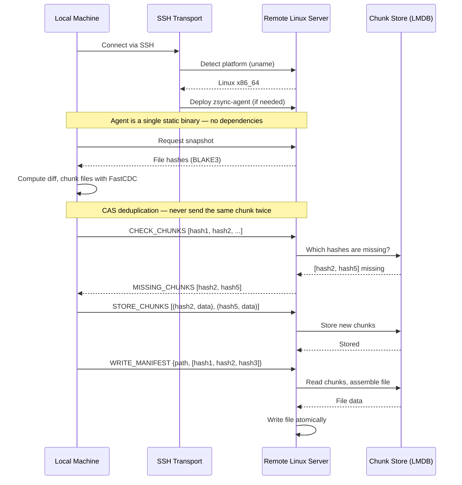

<p align="center">
  
</p>

<p align="center">
  <code>nix run github:andrewgazelka/zsync -- watch ./local user@host:/remote</code>
</p>

A modern alternative to rsync and mutagen for syncing files over SSH.

## Why zsync?

**Your remote server needs nothing installed.** zsync auto-deploys a tiny, statically-linked agent over SSH. No rsync, no dependencies, no setup — just SSH access.

| Feature | rsync | mutagen | zsync |
|---------|-------|---------|-------|
| Remote dependencies | rsync required | Auto-deploy (~50MB Go) | Auto-deploy (~3MB Rust) |
| Respects .gitignore | ❌ Manual exclude | ⚠️ Works but ignores global | ✅ **Automatic** |
| Watch mode | ❌ External tools | ✅ Built-in | ✅ Built-in |
| Deduplication | Per-file delta | ❌ Whole files | ✅ **Cross-file CAS** |
| Intra-file delta | ✅ Fixed blocks | ❌ No | ✅ **FastCDC chunks** |

## Features

- **Zero remote dependencies** — Agent auto-deploys via SSH (Linux x86_64/aarch64)
- **Native .gitignore** — Respects your existing ignore files automatically
- **CAS deduplication** — Content-addressable storage ensures each chunk is only sent once, ever
- **FastCDC chunking** — Content-defined chunking finds reusable blocks across all files
- **Watch mode** — Continuous sync with debouncing
- **Port forwarding** — Forward local ports to remote services through SSH
- **Static binaries** — Works on any Linux server, no glibc version issues
- **Fast** — BLAKE3 hashing, heed (LMDB) chunk store

## Quick Start

```bash
# One-time sync
zsync sync ./project user@server:/home/user/project

# Watch mode (continuous)
zsync watch ./project user@server:/workspace
```

## Install

```bash
# Nix (recommended)
nix run github:andrewgazelka/zsync

# Cargo
cargo install --git https://github.com/andrewgazelka/zsync
```

## How It Works



**The key insight:** zsync uses Content-Addressable Storage (CAS) with BLAKE3 hashes. Chunks are stored by their hash — if two files share content, those chunks are stored once. If you sync similar projects, unchanged code is never re-transferred. The server asks "which of these chunks do I need?" and you only send what's missing.

No `apt install`. No version conflicts. No "rsync: command not found".

## Supported Platforms

**Local (where you run zsync):**
- macOS (Apple Silicon, Intel)
- Linux (x86_64, aarch64)

**Remote (where files sync to):**
- Any Linux server with SSH access (x86_64, aarch64)
- Works on minimal containers, VMs, cloud instances — anywhere with SSH

## Configuration

Create a `.zsync.toml` in your project root for advanced settings:

```toml
# Include files even if they're gitignored
include = [".env", "secrets/config.yaml"]

# Port forwarding (active during watch mode)
[[forward]]
local = 8080    # Listen on localhost:8080
remote = 8080   # Forward to remote:8080

[[forward]]
local = 3000
remote = 3000
remote_host = "api-server"  # Forward to api-server:3000 on the remote
```

### Port Forwarding

In watch mode, zsync can forward local ports to the remote machine through the SSH connection:

```bash
zsync watch ./project user@server:/workspace
# Output: Forwarding localhost:8080 -> localhost:8080
```

Access remote services at `http://localhost:8080` — no separate SSH tunnel needed.

## Status

Early development. Core sync and watch mode work. Bidirectional sync coming soon.

---

MIT OR Apache-2.0
